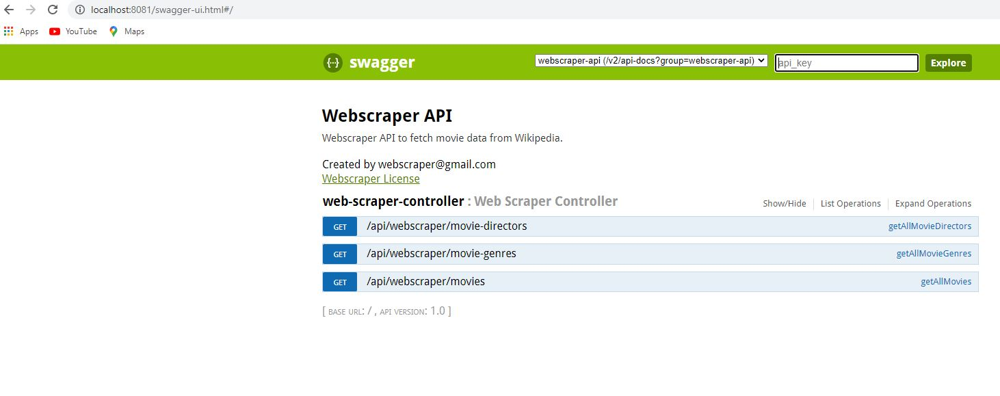
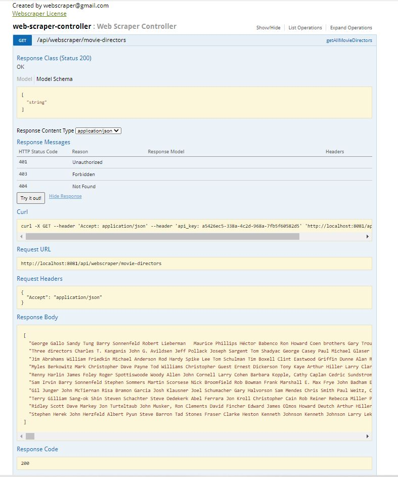
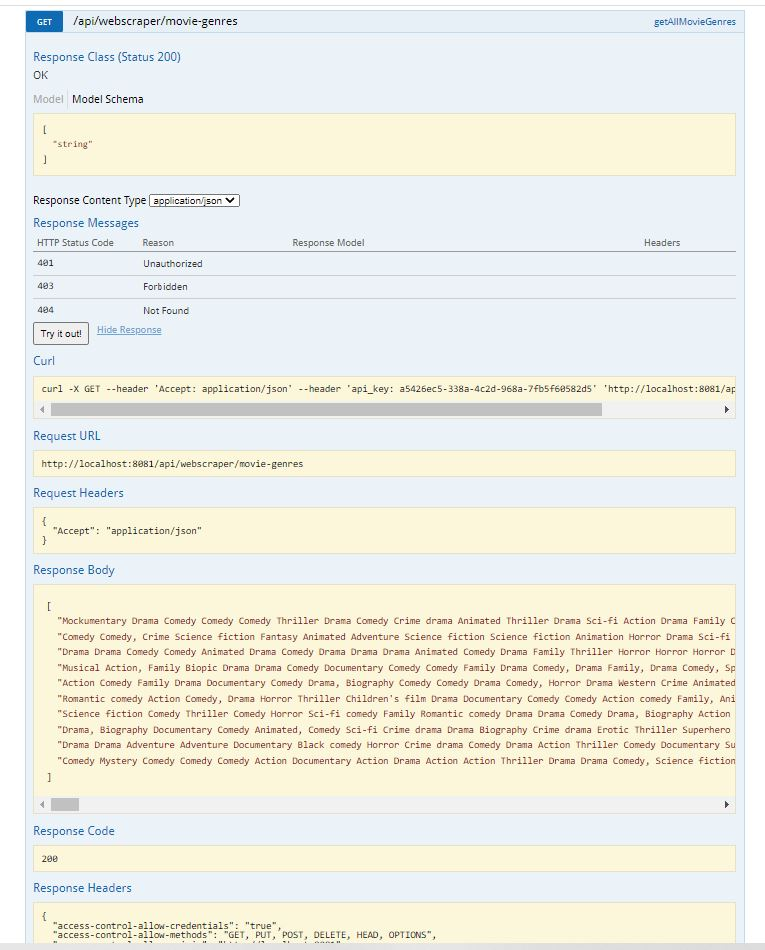
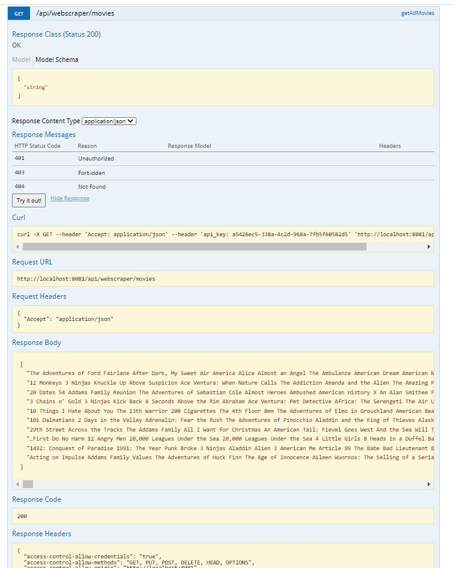
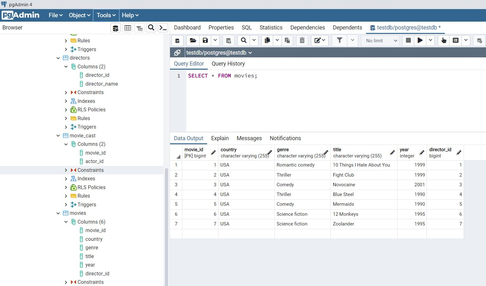
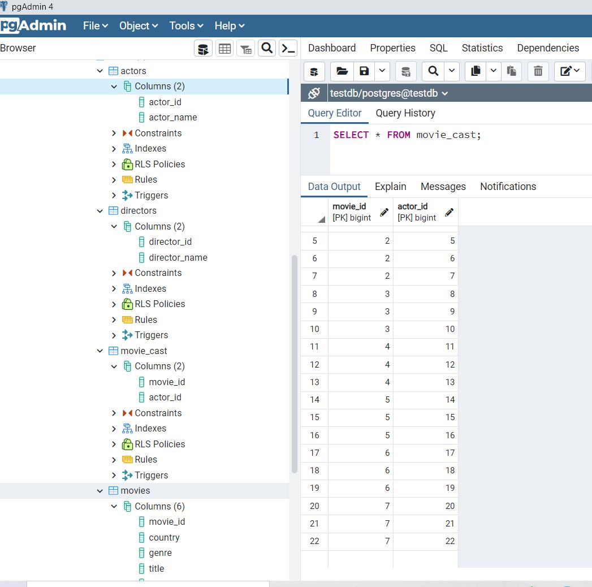
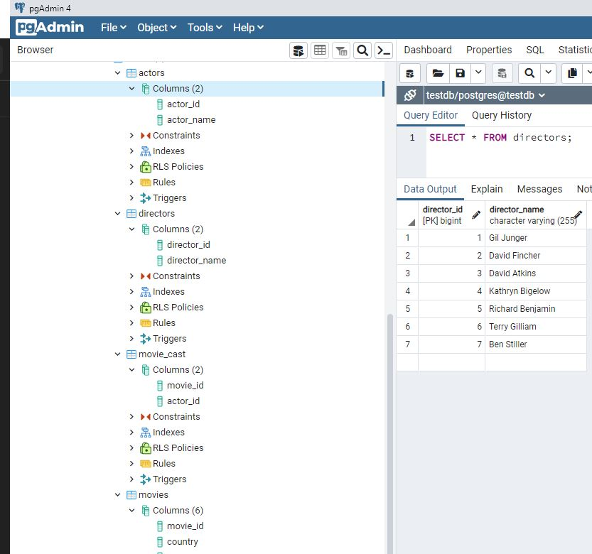

# Web Scraper: Java, Spring Framework & Jsoup

A RESTful API which fetches data from multiple web addresses (URLs) by parsing specific elements from their HTML structure. Implemented concurrency to speed up the process. Used Swagger for documentation of API.

## Features

**Completed**

It scrapes data about movies from Wikipedia. Currently, it targets the URLs within this URL: [List Of American Films](https://en.wikipedia.org/wiki/Lists_of_American_films)

**Note:** This tool follows the proper etiquette and it does not violate the [Terms of Use](https://foundation.wikimedia.org/wiki/Terms_of_Use/en#12._Termination) of Wikipedia. [Wikipedia's Licence](https://en.wikipedia.org/wiki/Wikipedia:Text_of_Creative_Commons_Attribution-ShareAlike_3.0_Unported_License) allows for free and legal usage of the site's public data.

* It fetches the following data for each movie by year:

  * Title
  * Director
  * Genre

* It returns data as a 'Set of Strings' in JSON.

**In Progress**

* Integrate a PostgreSQL database.
* In addition, fetch for each movie: cast, year, country and notes. 
* Publish public API.
* Define requirements for a **front-end**.
  * Research and evaluate best technology options to develop a dashboard.

## Tech stack

### Back-End

* REST API
* Java 8 
  * Stream API: used class Collectors for fast/simpler manipulation of the data (map-reduce paradigm).
  * Concurrency: used CompletableFuture class which implements Future & CompletionStage interfaces.
* Spring Framework
* Jsoup (Java Library) for fetching URLs, extracting, and manipulating data.

## Run Program

* Run from within the PJ folder in CL: **mvn spring-boot:run**

**Note**: You must have installed Java 8 & JDK plus Maven.

## Testing & Documentation of API

**Completed**

* This is a collection of the requests tested on the API: https://documenter.getpostman.com/view/16169448/UV5Rmfa7

* Documentation of API in Swagger: 
  
  > Swagger Documentation
  
  
  
**In Progress**

* Implement Monte Carlo testing for concurrency.

## Demo Pictures

> Demo 1
  

> Demo 2
  

> Demo 3
  

> Demo 4
  

> Demo 5
  

> Demo 6
  

